## Prerequizites
1. Make sure Virtualization Technology is enabled in BIOS.
2. Download and install [VirtualBox](https://www.virtualbox.org/wiki/Downloads).
3. Download [CentOS DVD ISO image](https://www.centos.org/download/).
4. Make sure hypervisor launch type is disabled. [Link](https://stackoverflow.com/a/50119065)

## Tasks

### 1. Creating a new virtual machine
Run VirtualBox and create a new virtual machine with the following requirements:
- Name: centos7 (etc.)  
  
  
- Memory size: >= 1024 Mb  
  
  
- Hard disk: create a dynamically allocated VDI virtual hard disk with size >= 10Gb  
  
  
  
  
  
- In settings of created VM enable 2nd network adapter attached to Bridged Adapter  
  
  
  
  
- In settings of created VM choose CentOS ISO image  
  
  
  
  
### 2. Installing CentOS
- start virtual machine  
  
  
- choose install CentOS 7  
  
  
  
- set language  
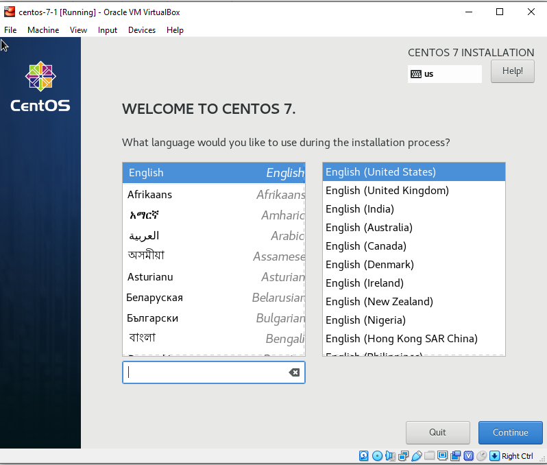  
  
- set timezone  
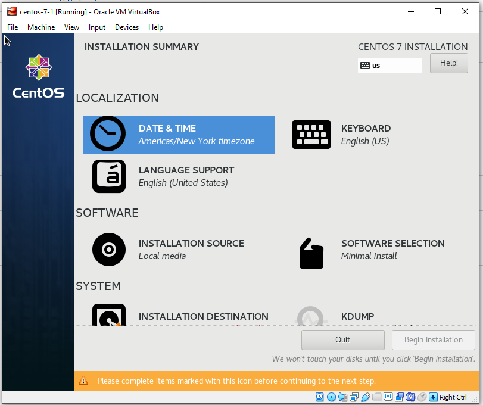  
  
  
- set hard disk partition layout - leave default 
  
  
- choose software  
  
  
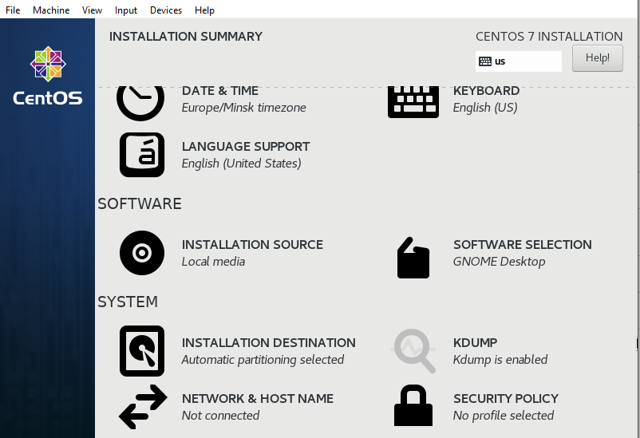  
  
- Set root password  
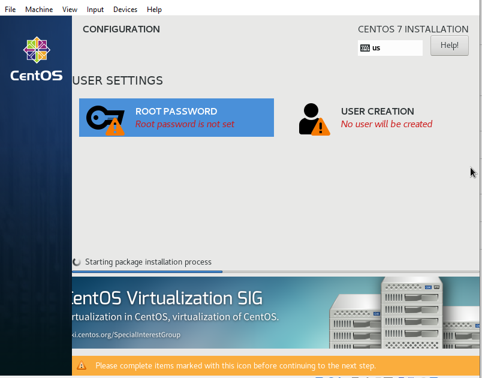  
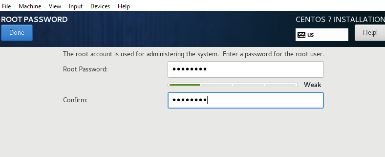  
  
- Create user "devops". Don't make this user administrator. Leave the remaining settings unchanged  
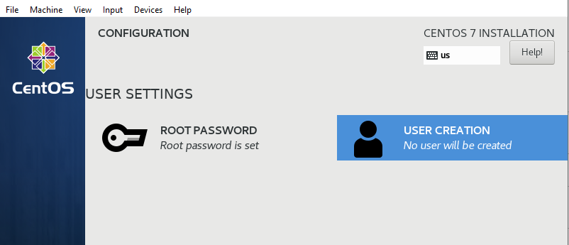  
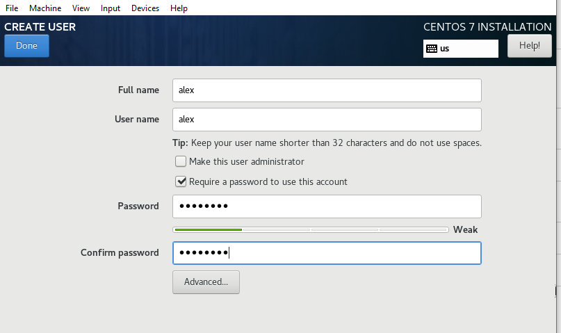  
  
- apply licence  
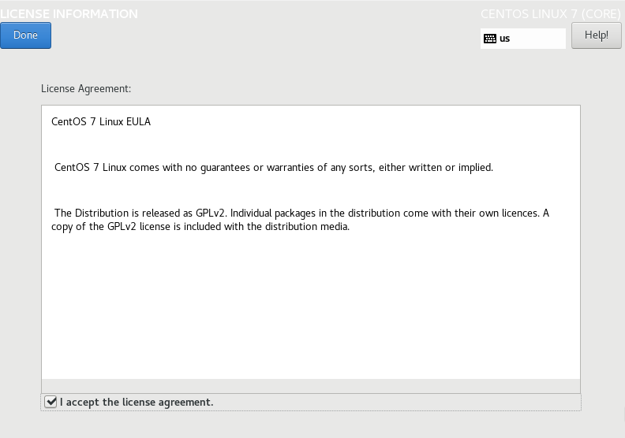  
  
- Network and Hostname - Ethernet-Configure-General-Mark "Automatically connect to this network ..." (repeate for 2nd adapter)  
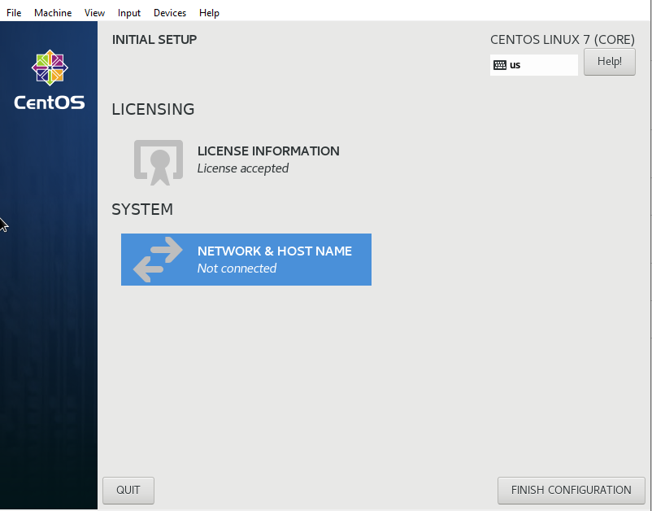  
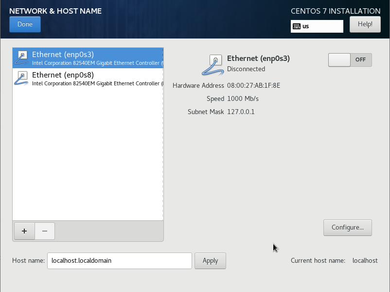  
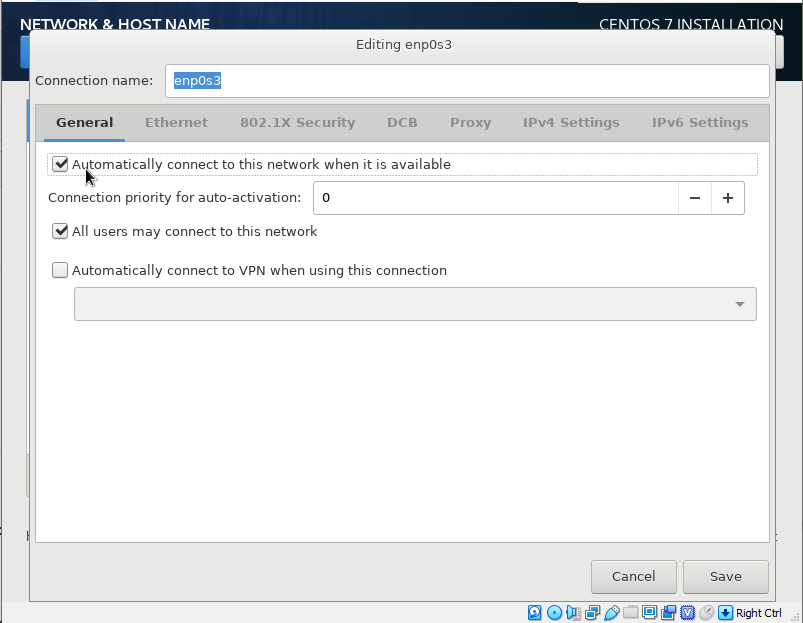  
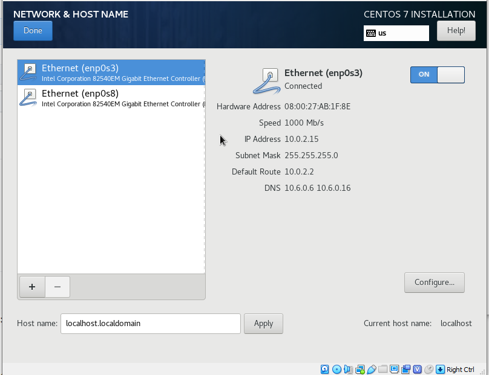  
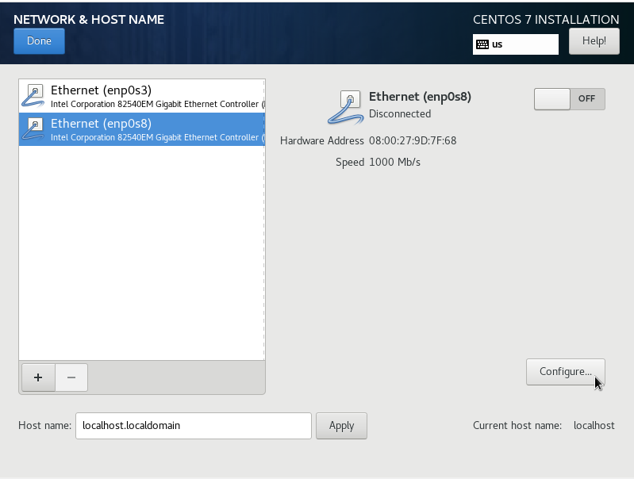  
  
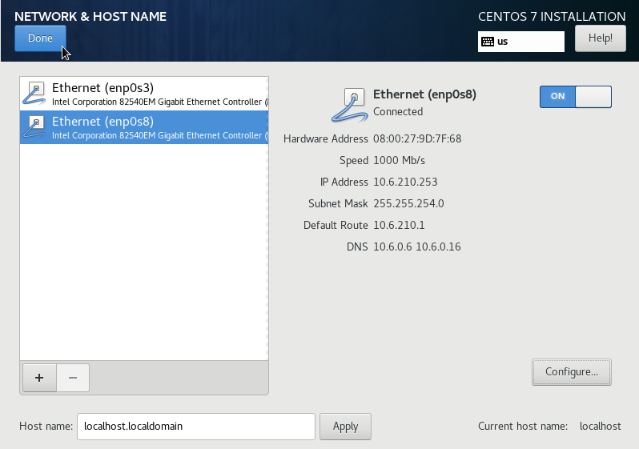  
  
### 3. Running CentOS
- log in to installed CentOS with "devops" credentials.  
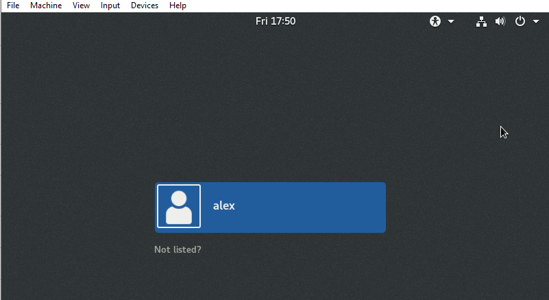  
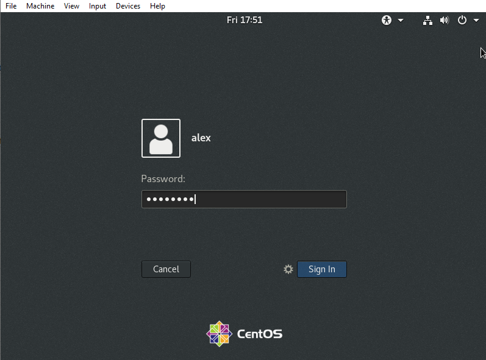  
  
- explore CentOS graphical interface, find files viewer, terminal emulator, simple text editor.  
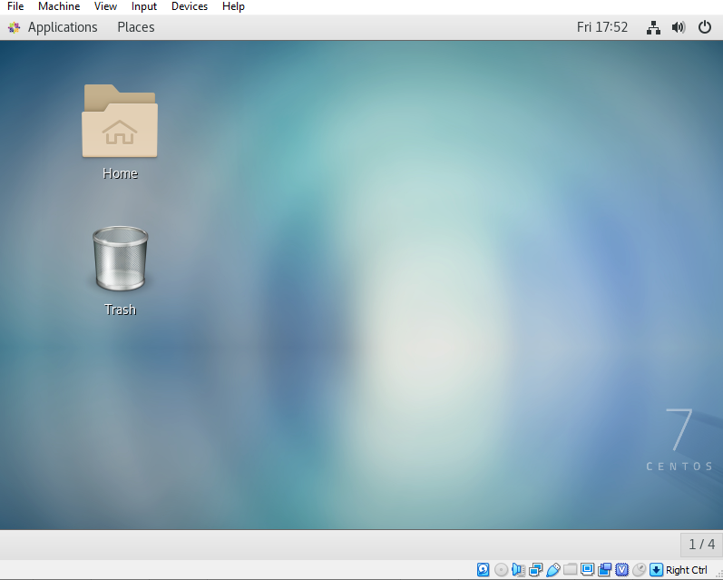  
  
